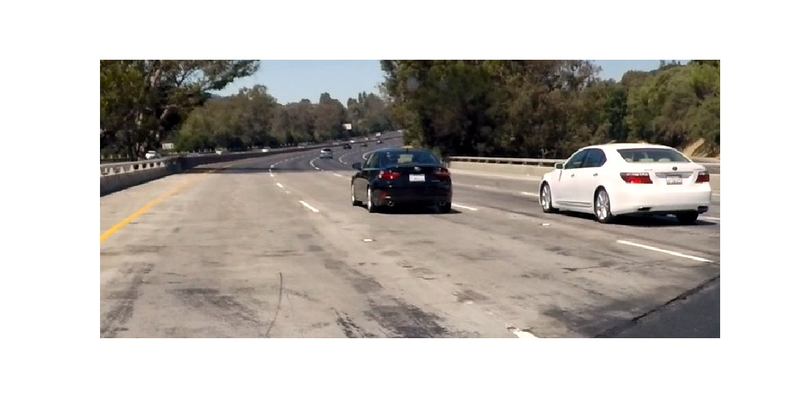
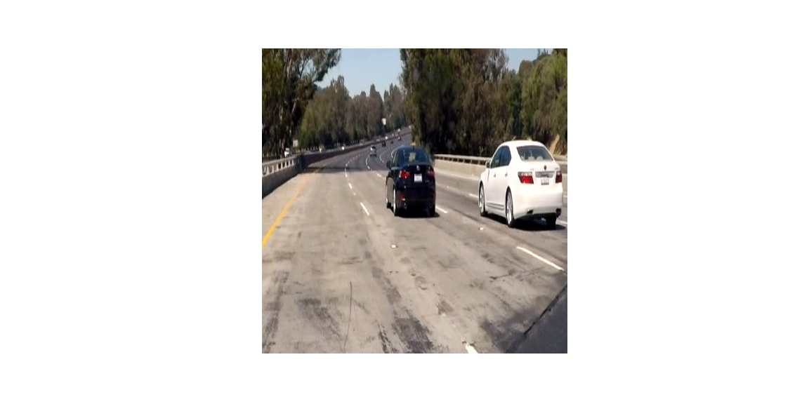
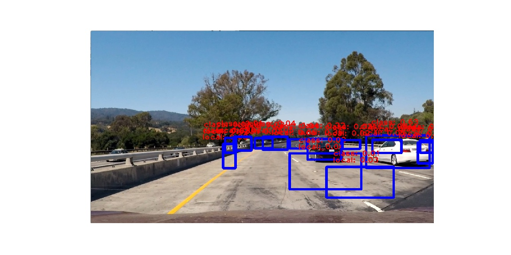
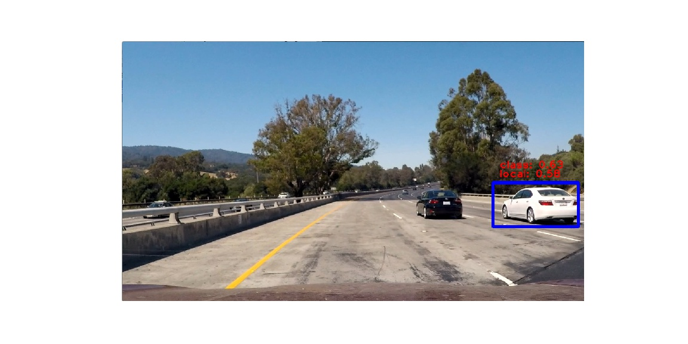
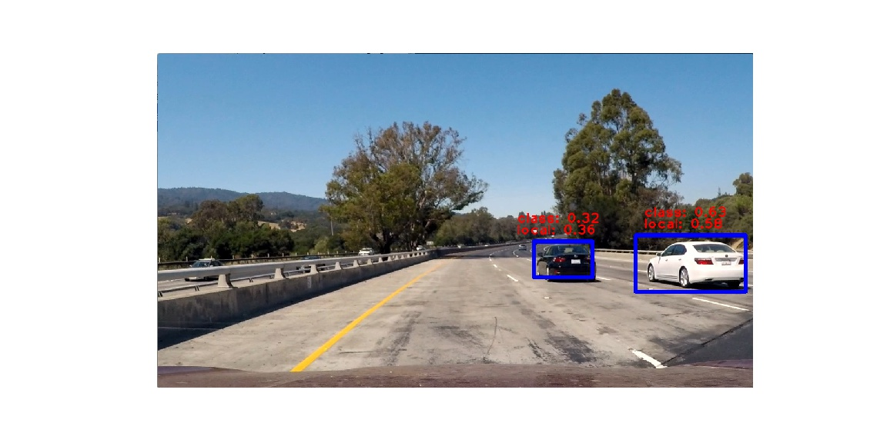

# Vehicle Detection Project

---

## Object Detection Methods

This project asks that we detect vehicles in an image or video. The class introduces Histogram of Gradients (HOG) to extract feature shapes. HOG features may be used with color features to distinguish vehicle objects from non-vehicle objects. Images of vehicle and non-vehicle objects are used to train a linear Support Vector Machine (SVM). Sliding windows with varying dimension must then be iterated across the full image to search for vehicle objects. So network is used to classify the object, but localization is handles crudely by brute force.

It turns out that this an expensive method of object detection. The network must run a forward pass on each window. Regional Convolutional Neural Networks (RCNN) improve performance by proposing potential regions where potential objects may exists. Classification must still be run multiple times for localization and detection must still be post-processed to eliminate duplicate detections.

You Only Look Once (YOLO) is convolutional neural network that computes localization and classification simultaneously. YOLO runs about one or two orders of magnitude faster than sliding window and RCNN. The input image is divided into 7x7 grid cells. Multiple bounding boxes of different ratios and sizes are predicted. Each box computes the following:
-x,y - box position
-w,h - box dimensions
-Intersection over Union (IOU) - confidence that box contains object and in box dimensions
-Classification score

I used the Tiny YOLO network trained on PASCAL VOC 20 image classification for this project.

## My Code

[./Vehicle_Detection-MC-YOLOv1-submit.ipynb] - Complete implementation of YOLO v1
[./Vehicle_Detection-MC-YOLOv2-incomplete.ipynb] - Incomplete implementation of YOLO v2
[./utils/utils.py] - various functions for processing inputs and outputs, loading weights

## Model Architecture

Tiny YOLO v1 contains: 
- 9 convolutional layers
- 6 maxpooling layers
- leaky ReLU activation (slope is 0.1 when input is less than 0)
- 6 max pooling layers
- 3 fully connected layers
- 448x448x3 input image size
- SXS=7x7 grid cells for bounding box predictions
- B=2 bounding boxes per grid cell
- 5 predictions per box
..- x,y positions
..- w,h box dimensions
..- confidence score (object detection and box dimensions)
- C=20 classifications scores (20x for PASCAL VOC)
- output is SxSx(B*5+C) = 7x7x(2*5+20) = 1470 tensor

Tiny YOLO Model

## Preprocessing

YOLO requires an input image size of 448x448x3 that's normalized from -1 to 1. This means the the input is warped compared to the original image. It's unclear what impact this has on the YOLO detection network.

Original test1 image

Cropped test1 image

Resized test1 image for YOLO model input

 

## Detection Sensitivity

Thresholds for classification and localization may be tuned independently. The code is in function yolo_net_out_to_car_boxes() in util.py. class_thresh determines the minimum classification score required for detection. local_thresh determines the minimum localization score. Setting these thresholds too low may result in false positive detections while setting them too high will result in false negative detection.

I created videos at various thresholds to calibrate the thresholds.

Low threshold leads to false positive detection

High threshold leads to false negative detection

Well balanced thresholds

Duplicate boxes are hanled by the box_iou() function in util.py. When 2 boxes intersect completely, the function returns 1. When 2 boxes have no intersection, then it returns 0. Partial intersection will have values between 0 and 1. I tuned the detection to remove boxes with greater than 0.4 intersection.

## Discussion

The Tiny YOLO network is extremely powerful and efficient. It was designed to run on real time video. My computer CPU processed the video it at 1.5 fps. Computers with fast GPUs can run it at greater than 150 fps. This is required for a self-driving car since objects in its view can move quickly.

YOLO was trained in PASCAL VOC to classify 20 different objects. It could run faster if it were optimized for vehicle detection only. However, a self-driving must also be able to detect, road signs, pedestrians, and other objects in its driving path.

YOLO v2 was a released a few months after the initial version. It promises even faster processing speed with improved classification and localization. The outputs are handled differently and I did not have enough time to complete my implementation for this project.

The network handles images and video in the same manner. It does not track vehicles from frame to frame. Objects in a previous frame are very likely to be in the next frame. We also know that objects can only appear and disappear from the edges of the frame. Using all this information could significantly improve detection performance and efficiency. 

As drivers, we are taught to look as far down the road as possible to help us anticipate changes in driving conditions. Although YOLO can detect nearby vehicles very well, it cannot detect vehicles further away. I would not be comfortable driving with such limited vision.

The developers acknowledge this weakness. Small objects and objects clustered together are difficult to detect. One way to improve this is by increasing the number of grid cells and increasing the image input resolution. Of course, this will reduce the speed of the network, counter to the developers' main intentions.

Using multiple cameras with different focal lengths could also help here. Tesla, for example, has two main imaging cameras on their system. One has a wide angle view, similar to the view in this project, while the other is more narrow, allowing the system to look further down the road.

The box overlap function does well in eliminating duplicate detections but it also eliminates the detection of multiple cars in the same area. If 2 cars are next to each other, then only one box is drawn. It would be better if the model could distinguish between multiple detections of the same car versus single detections of multiple cars.

## Reference

1. J. Redmon, S. Divvala, R. Girshick, and A. Farhadi, You Only Look Once: Unified, Real-Time Object Detection, arXiv:1506.02640 (2015).
2. J. Redmon and A. Farhadi, YOLO9000: Better, Faster, Stronger, arXiv:1612.08242 (2016).
3. darkflow, https://github.com/thtrieu/darkflow
4. Darknet.keras, https://github.com/sunshineatnoon/Darknet.keras/
5. YAD2K, https://github.com/allanzelener/YAD2K
6. xslittlegrass, https://github.com/xslittlegrass/CarND-Vehicle-Detection
7. Stanford University cs213n Lecture 11,https://www.youtube.com/watch?v=nDPWywWRIRo&t=3947s